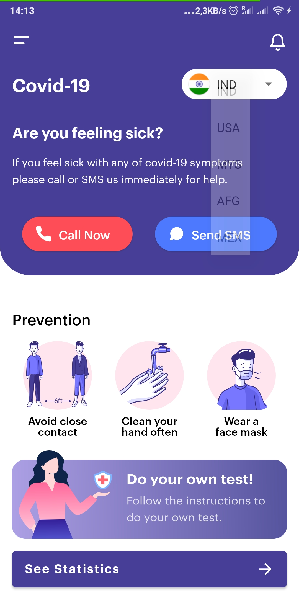
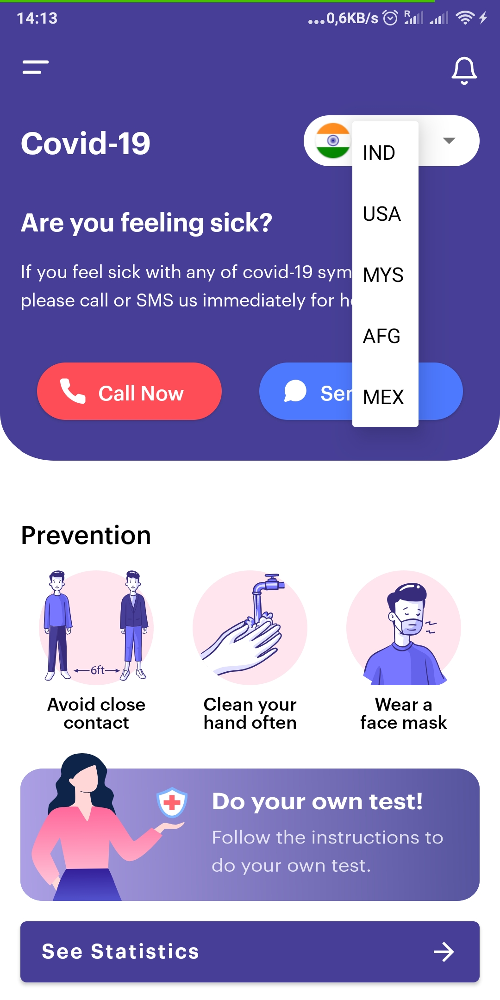
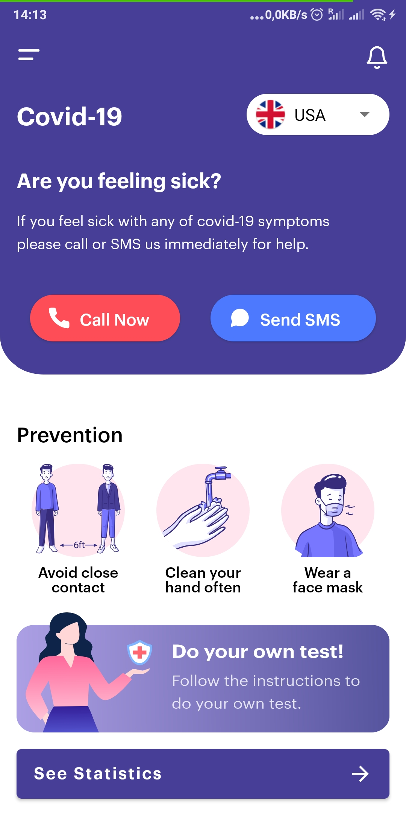
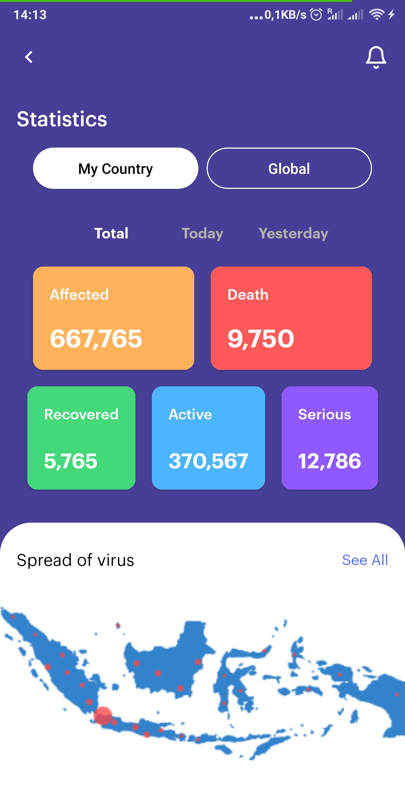

# Covid 19 Android Application

    

The Covid 19 Android Application is a simple **Android** Application with a modern, appealing UI design meant to help users to receive valuable information regarding the current global pandemic and provide a tool for seeking help when needed. The project is written in **Java** using **Android Studio** and it uses basic elements of the Android framework like: Views, Layouts, Resources, Activities, Intents and many others.

 

# Demo 

To run the applicaiton download the build apk from the link below, uplaod the apk into your android device and install the aplication from the build apk.

### [APK](./covid19.apk)

 
 

# Features

* Spinner for selecting the country of interest or residence from the list 🎏 🌐
* Image flangs for each of the selected items
* Button for calling the emergency health department 📞
* Button for sending an SMS message to the authorized and qualified professionnel 💬
* Prevention meassurements images and text.
* Statistics separate page accessible by clicking on the See Statistics button. Opens a new page displaying the statistics details about the total number of affected cases, death, curred, active and a map showcasing the spread of the virus. 🧮
* Buttons for selecting country specific statistics of global.
* Options for selecting the total numbers of statistics or daily by today or yesterday
 
 
 

<li>
 The application does not have implemented the functionality for calling, sending a message, seeing the statistics and recomandation according to the selected country or displaying the statiscitcs according to the selected scope (My contry, Global), or time (total, today, yesterday). These features will be released in a future version.

 
 
 

# Technologies used :
 
<h2> 

&nbsp;&nbsp;&nbsp;&nbsp;&nbsp;
* Android Studio  
 

# Gallery

 
 
 

# To run the project locally

## Pre-requisites:
- Android Studio
- Android SDK

## Steps:

1. Clone the repository or download the source code in a zip
2. Open Android Studio with the project.
3. Run the app on the emulator or on the USB connected phone.

### Have fun with project and thank you for your attention. 😊 😉
